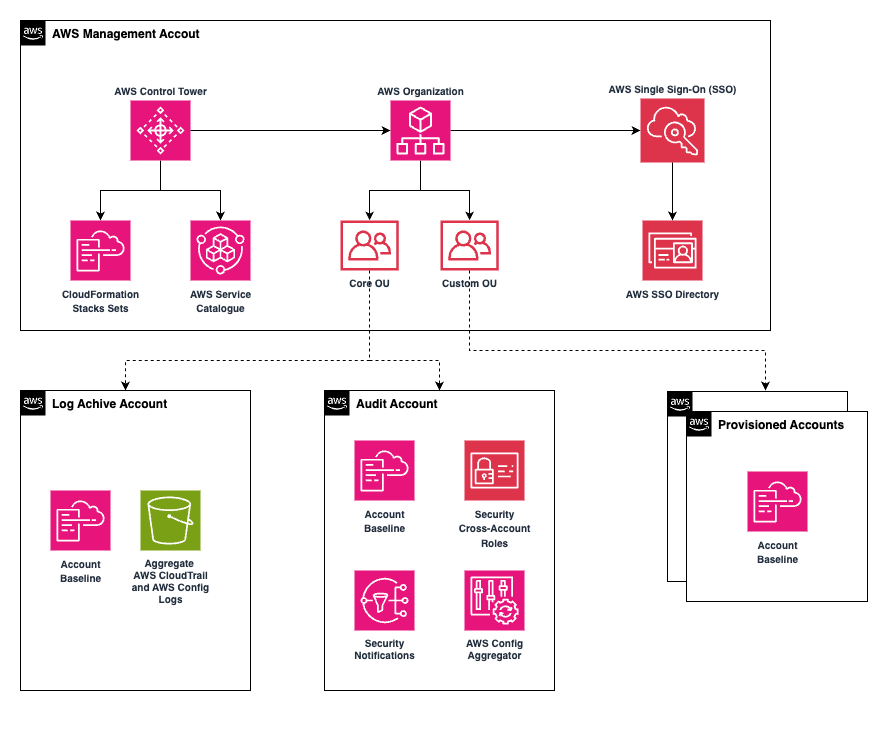

# Terraform Infra for GASPI

Terraform Infra for Genetic Analysis Support Platform Indonesia (GASPI)

## AWS Control Tower

<div align="center">
    
</div>


## AWS Organization

```
.
├── GXC-Management
│   ├── gxc-consortium-logarchived   (123456789890 | gxc-consortium-logarchived@domain.com)
│   ├── gxc-consortium-management    (112233445566 | gxc-consortium-management@domain.com)
│   └── gxc-consortium-securityaudit (223344556677 | gxc-consortium-securityaudit@domain.com)
└── GXC-OrganizationUnit
    ├── GXC-Billing
    │   └── gxc-consortium-billing   (098765432123 | gxc-consortium-billing@domain.com)
    ├── gxc-consortium-hub01         (111122223333 | gxc-consortium-hub01@domain.com)
    ├── gxc-consortium-hub02         (222233334444 | gxc-consortium-hub02@domain.com)
    └── gxc-consortium-hub03         (555566667777 | gxc-consortium-hub03@domain.com)
```

## Terraform Structure

```
tree -L 3    # three-levels show
---
.
├── LICENSE
├── README.md
├── docs
│   ├── assets
│   └── tf-output
├── environments
│   ├── gxc-hub01 (AWS_ACCOUNT_HUB01)
│   │   ├── _tfstate
│   │   ├── budget
│   │   ├── cloudtrails
│   │   ├── iam-logging
│   │   ├── iam-tfuser-executor
│   │   └── iam-user
│   ├── gxc-hub02 (AWS_ACCOUNT_HUB02)
│   │   ├── _tfstate
│   │   ├── budget
│   │   ├── cloudtrails
│   │   ├── iam-logging
│   │   ├── iam-tfuser-executor
│   │   └── iam-user
│   └── gxc-management (AWS_ACCOUNT_MANAGEMENT)
│       ├── _kms_cmk-gxc-staging
│       ├── _tfstate
│       ├── budget
│       ├── core-ec2
│       ├── iam-tfuser-executor
│       └── iam-user
├── gen-docs.sh
├── modules
│   ├── audit
│   │   ├── central-logging
│   │   ├── cloudtrails
│   │   └── cloudtrails-opensearch
│   ├── _tfstate
│   ├── budget
│   ├── iam-logging
│   ├── iam-tfuser-executor
│   ├── iam-user
│   ├── s3-logs
│   └── tfstate
└── scripts
    └── cleanup-resources

```

## Copyright

- Author: **DevOps Engineer (devops@xapiens.id)**
- Vendor: **Xapiens Teknologi Indonesia (xapiens.id)**
- License: **Apache v2**
