# CloudFront SSL Setup - Architecture Documentation

This document describes the architecture, components, and design decisions behind the CloudFront SSL Setup solution for the Xignals observability platform.

## 📋 Table of Contents

- [Overview](#overview)
- [High-Level Architecture](#high-level-architecture)
- [Component Architecture](#component-architecture)
- [Data Flow](#data-flow)
- [Security Architecture](#security-architecture)
- [Network Architecture](#network-architecture)
- [Deployment Architecture](#deployment-architecture)
- [Scaling Architecture](#scaling-architecture)
- [Disaster Recovery Architecture](#disaster-recovery-architecture)

## 🏗️ Overview

The CloudFront SSL Setup solution provides automated deployment and management of AWS CloudFront distributions with SSL certificates, specifically optimized for observability platforms like Xignals. The architecture follows cloud-native best practices with emphasis on security, scalability, and reliability.

### Core Design Principles

- **Security First**: Multi-layered security with custom headers and WAF integration
- **High Availability**: Multi-region support with automated failover
- **Performance Optimized**: Edge caching with observability-specific optimizations
- **Cost Efficient**: Intelligent caching strategies and resource optimization
- **Automation Ready**: CI/CD integration with comprehensive testing
- **Observability Native**: Self-monitoring and integration with monitoring tools

## 🌐 High-Level Architecture

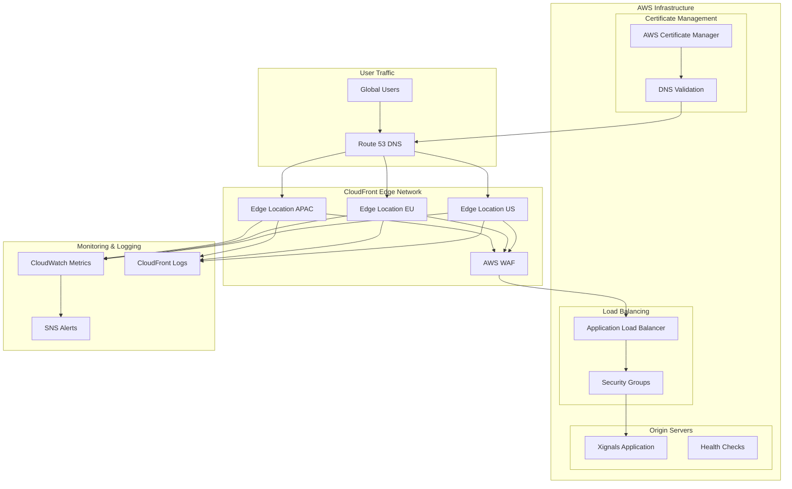

## 🧩 Component Architecture

### Core Components

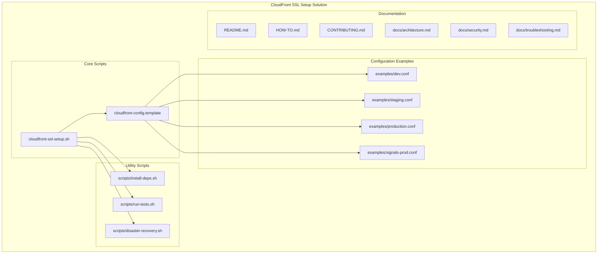

### AWS Service Integration

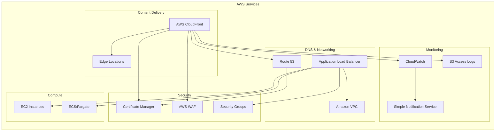

## 🔄 Data Flow

### Request Flow Architecture

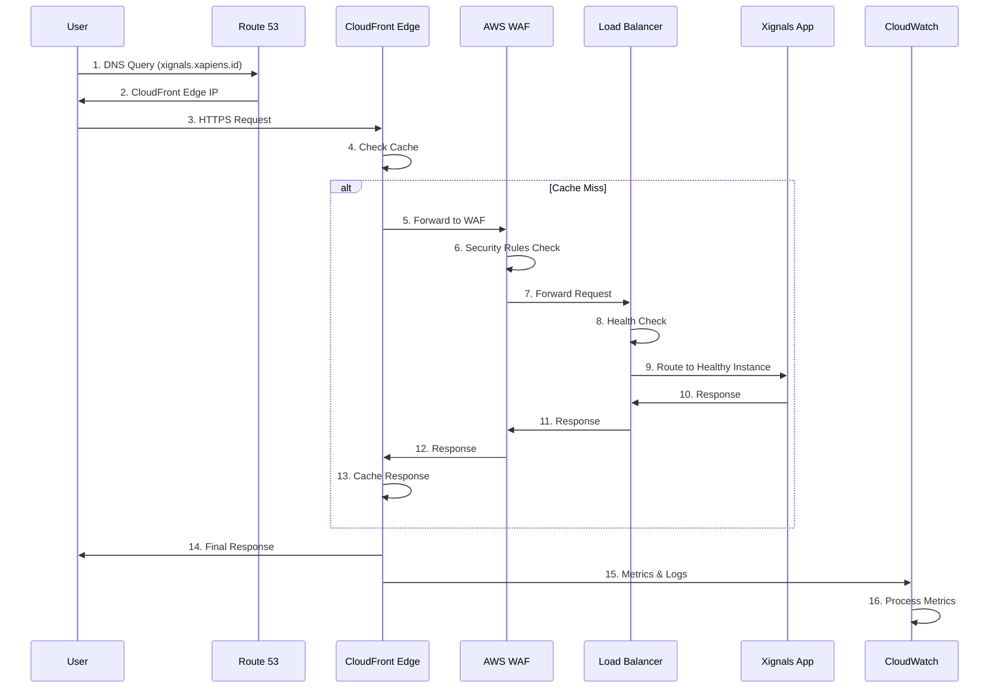

### SSL Certificate Provisioning Flow

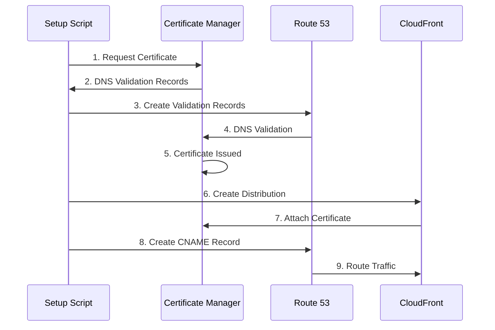

## 🔒 Security Architecture

### Multi-Layer Security Model

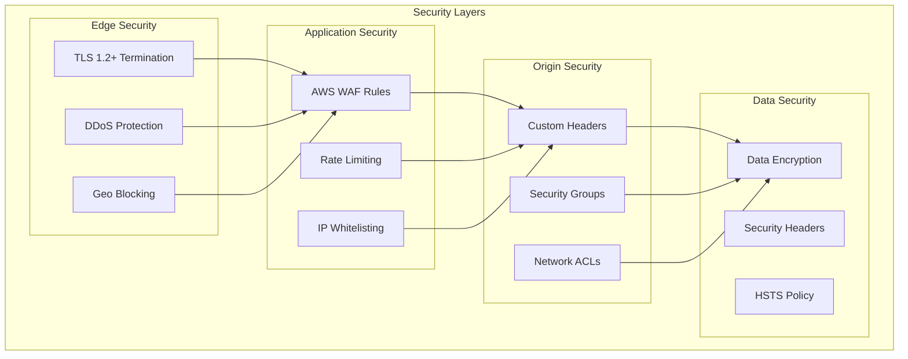

### Security Controls Flow

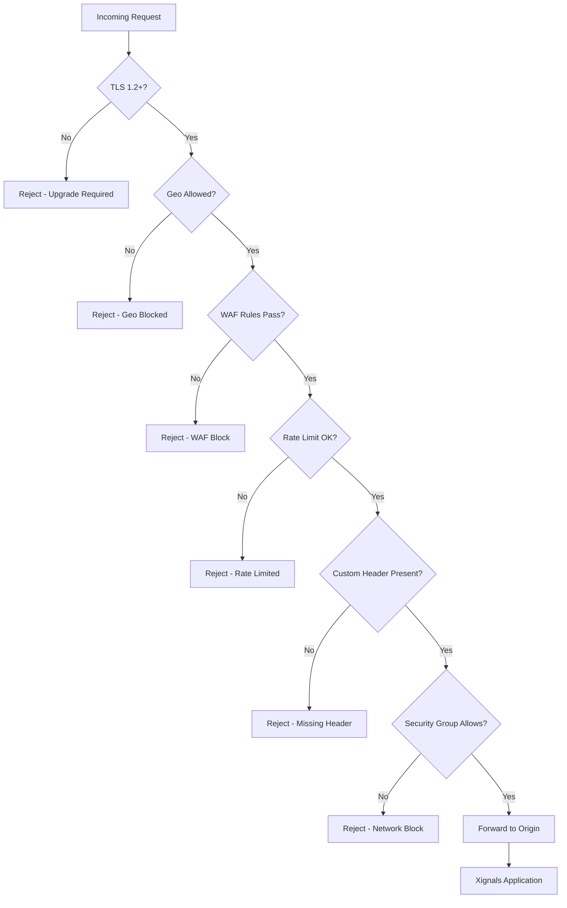

## 🌍 Network Architecture

### Multi-Region Network Topology

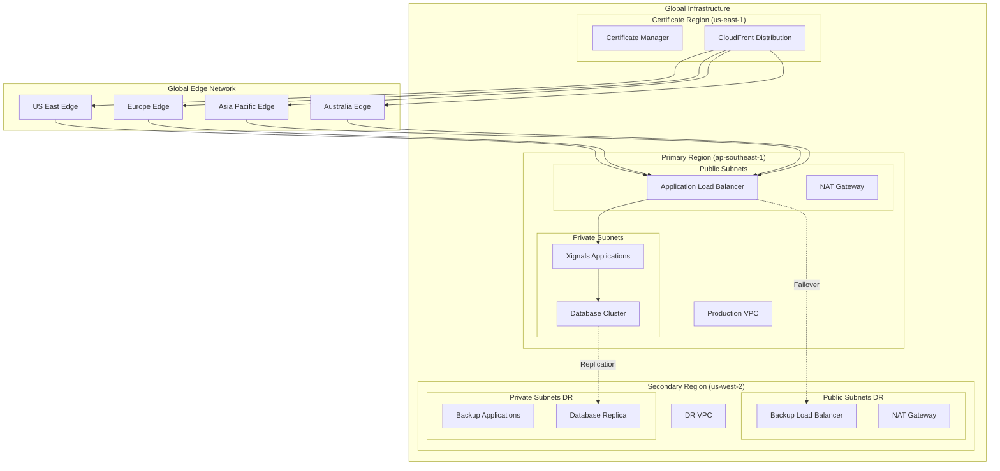

### Security Group Architecture

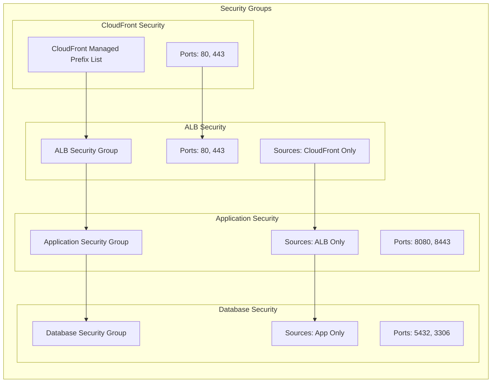

## 🚀 Deployment Architecture

### CI/CD Pipeline Architecture

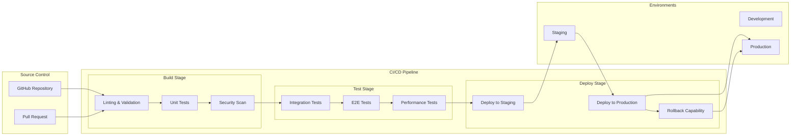

### Blue/Green Deployment Model

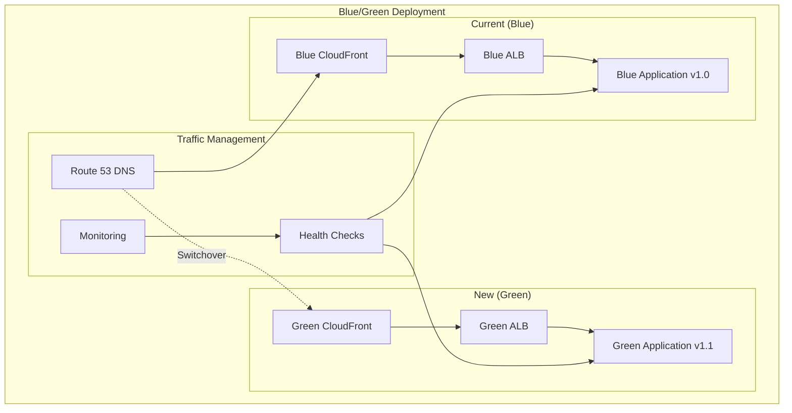

## 📈 Scaling Architecture

### Auto-Scaling Model

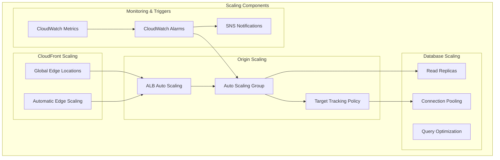

### Performance Optimization Architecture

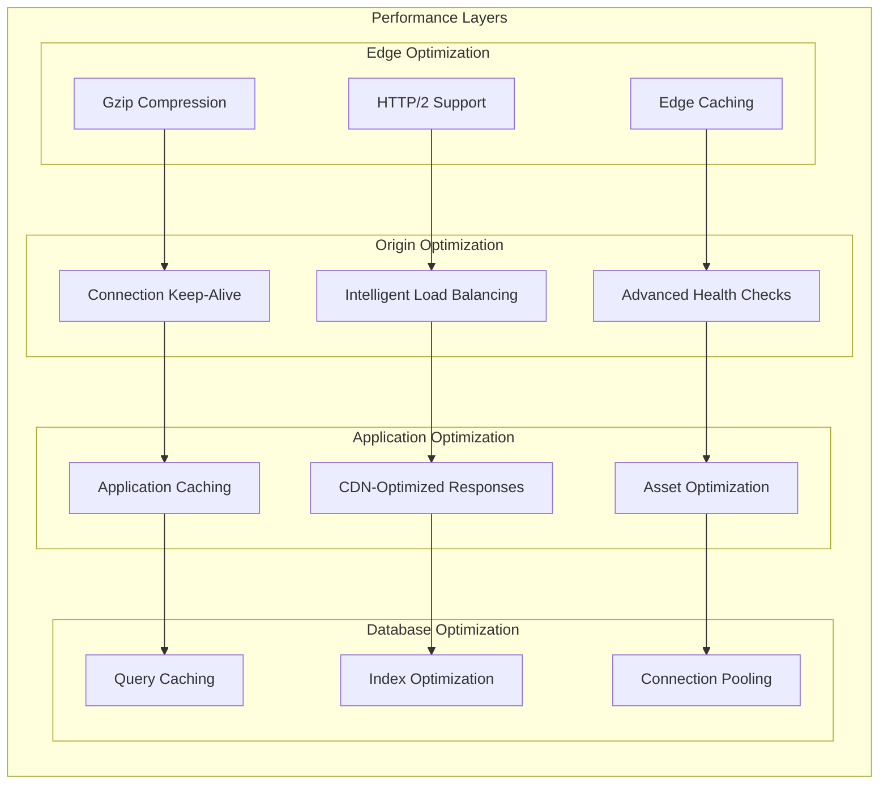

## 🔄 Disaster Recovery Architecture

### Multi-Region DR Strategy

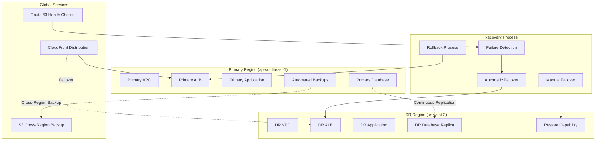

### Backup and Recovery Flow

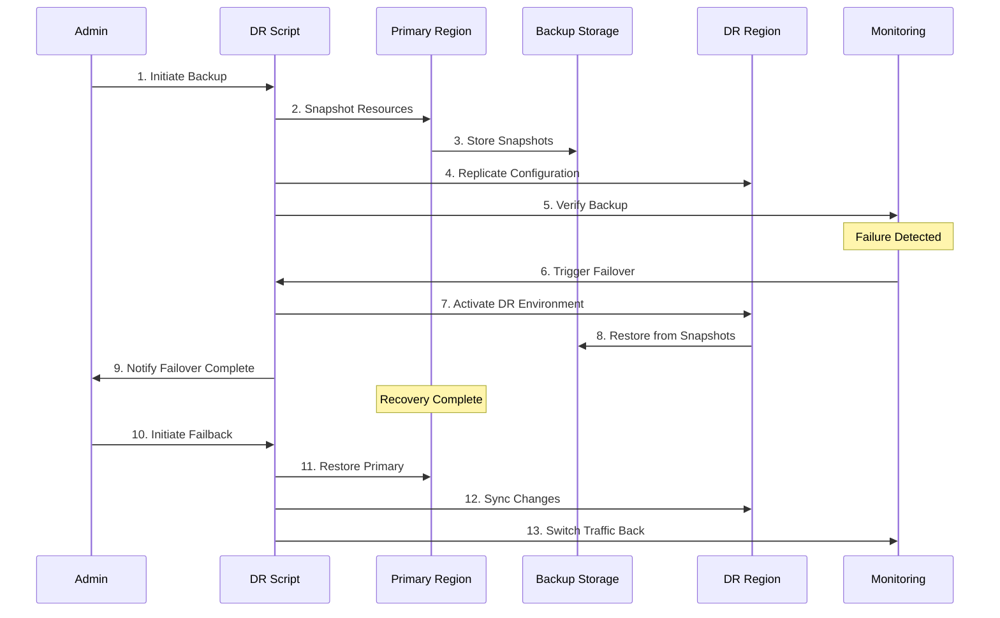

## 🔍 Observability Architecture

### Xignals Self-Monitoring

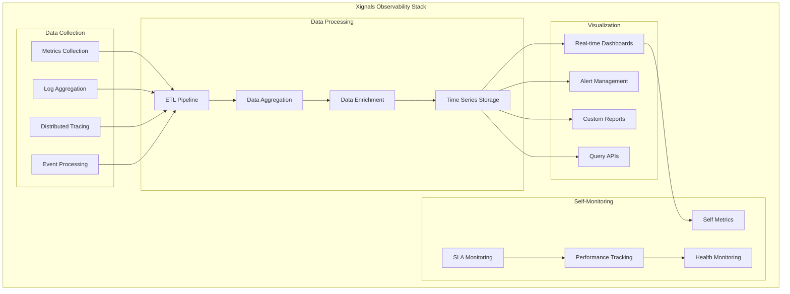

## 📊 Cost Optimization Architecture

### Cost Management Strategy

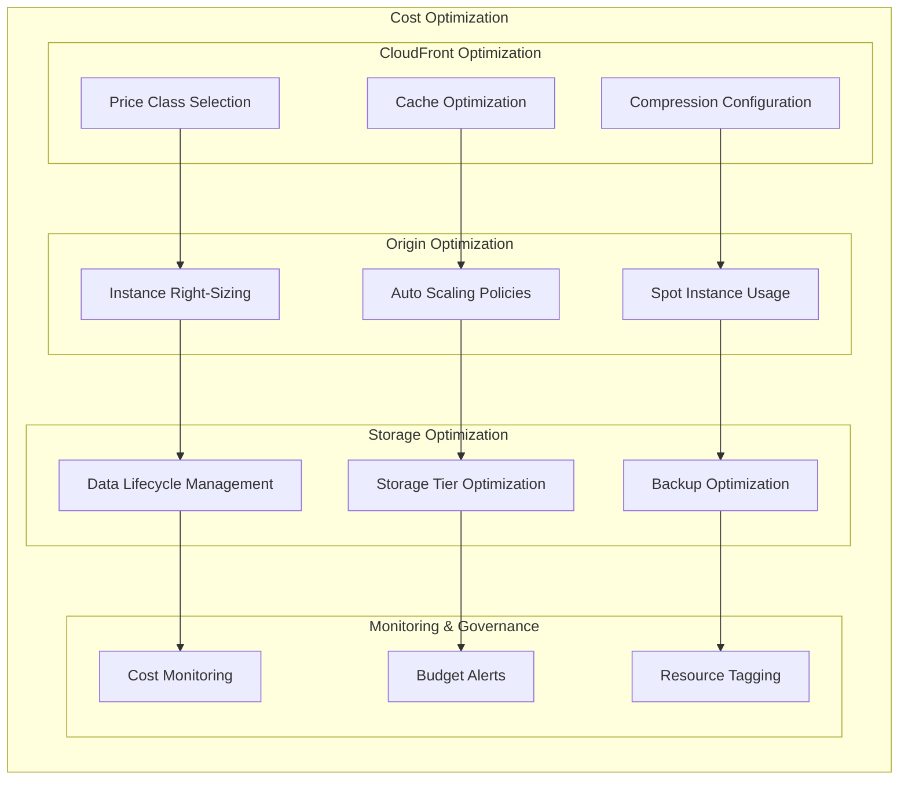
