# CloudFront SSL Setup - Security Documentation

This document provides comprehensive security guidance, threat model analysis, and security best practices for the CloudFront SSL Setup solution.

## 📋 Table of Contents

- [Security Overview](#security-overview)
- [Threat Model](#threat-model)
- [Security Architecture](#security-architecture)
- [Authentication & Authorization](#authentication--authorization)
- [Network Security](#network-security)
- [Data Protection](#data-protection)
- [Monitoring & Incident Response](#monitoring--incident-response)
- [Compliance & Governance](#compliance--governance)
- [Security Checklist](#security-checklist)

## 🛡️ Security Overview

The CloudFront SSL Setup solution implements defense-in-depth security principles across multiple layers, providing comprehensive protection for observability platforms like Xignals.

### Security Principles

- **Zero Trust Architecture**: Never trust, always verify
- **Least Privilege Access**: Minimal required permissions
- **Defense in Depth**: Multiple security layers
- **Continuous Monitoring**: Real-time threat detection
- **Incident Response Ready**: Automated response capabilities
- **Compliance First**: Built-in compliance controls

### Security Domains

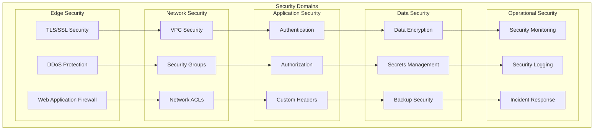

## 🎯 Threat Model

### Threat Analysis Framework

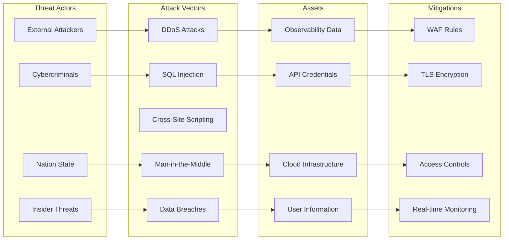

### Risk Assessment Matrix

| Threat | Likelihood | Impact | Risk Level | Mitigation |
|--------|------------|--------|------------|------------|
| DDoS Attack | High | High | **Critical** | CloudFront DDoS Protection + WAF |
| Data Interception | Medium | High | **High** | TLS 1.2+ + Certificate Pinning |
| Origin Bypass | Medium | High | **High** | Custom Headers + Security Groups |
| Credential Theft | Medium | Medium | **Medium** | Secrets Manager + IAM Policies |
| Insider Threat | Low | High | **Medium** | Least Privilege + Audit Logging |

### Attack Surface Analysis

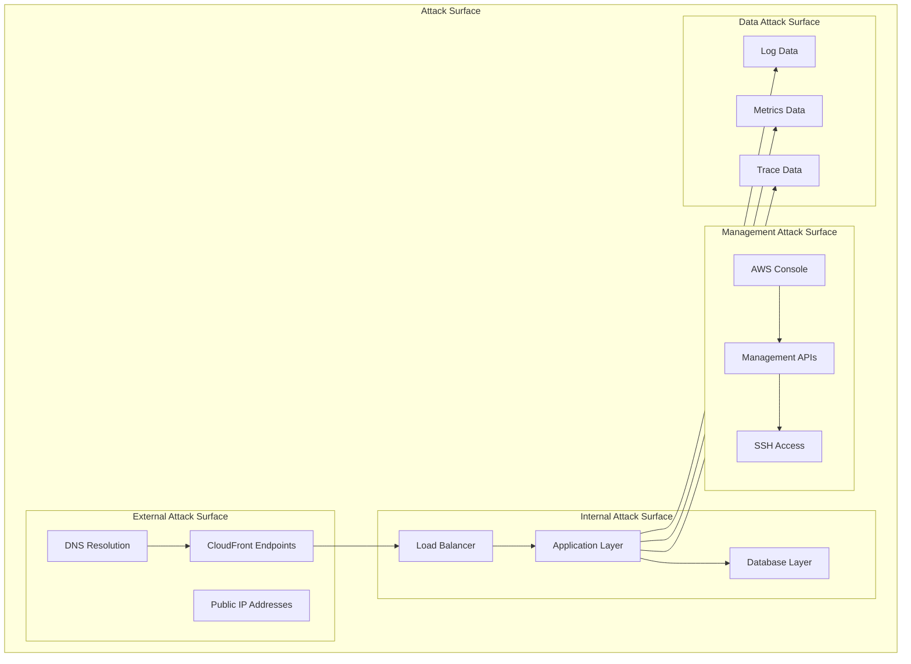

## 🔐 Security Architecture

### Multi-Layer Security Model

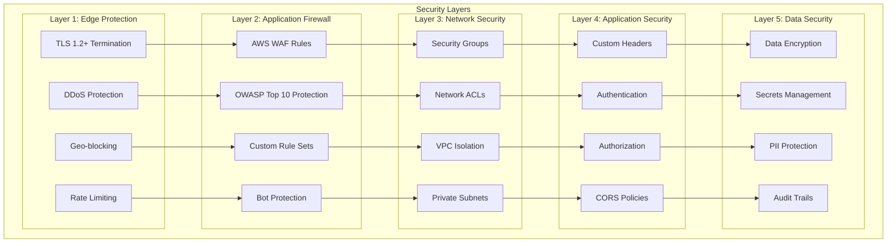

### Security Control Flow

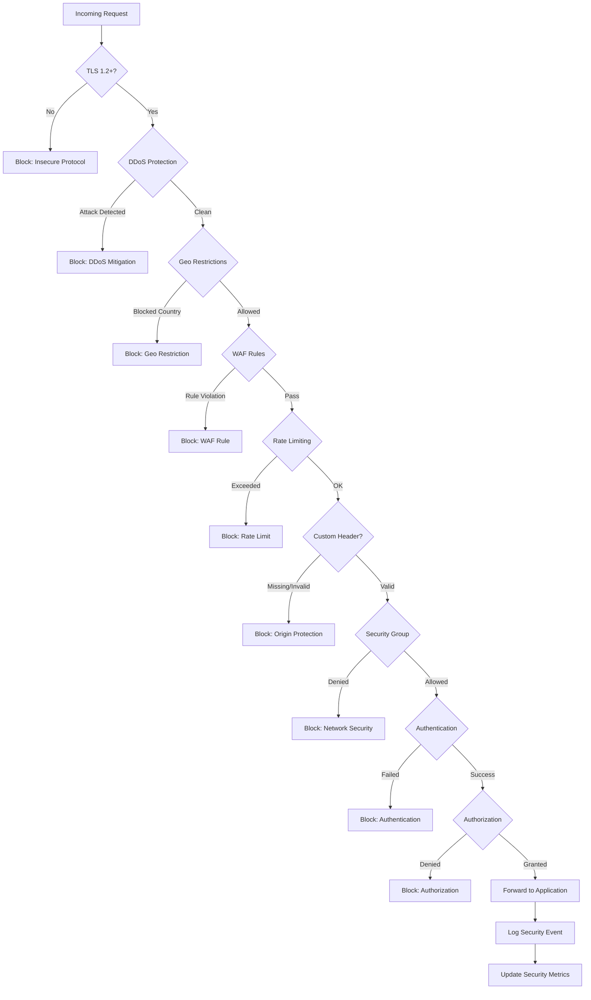

## 🔑 Authentication & Authorization

### Identity and Access Management

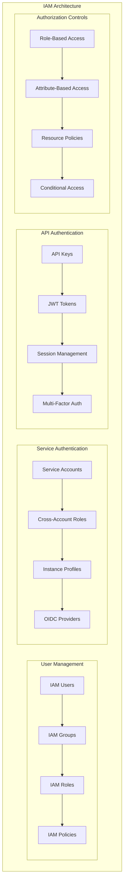

### Custom Header Security

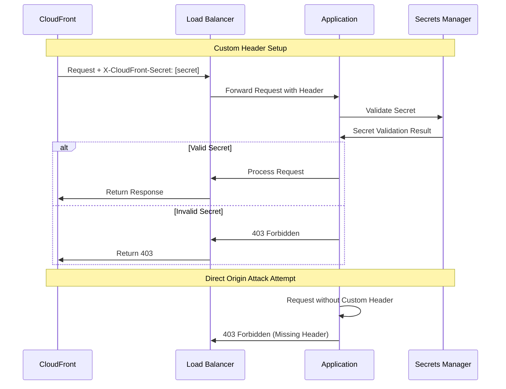

## 🌐 Network Security

### VPC Security Architecture

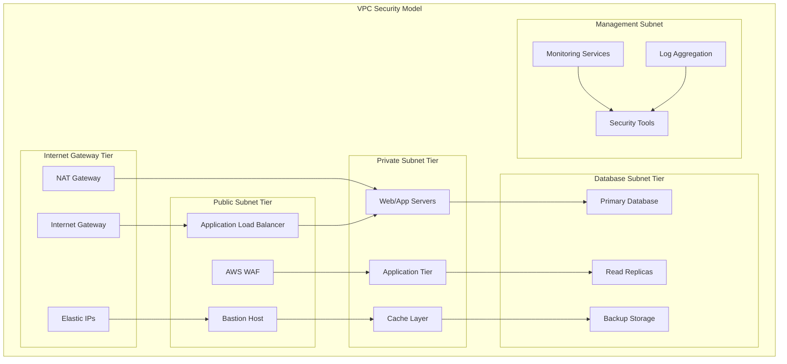

### Security Group Rules

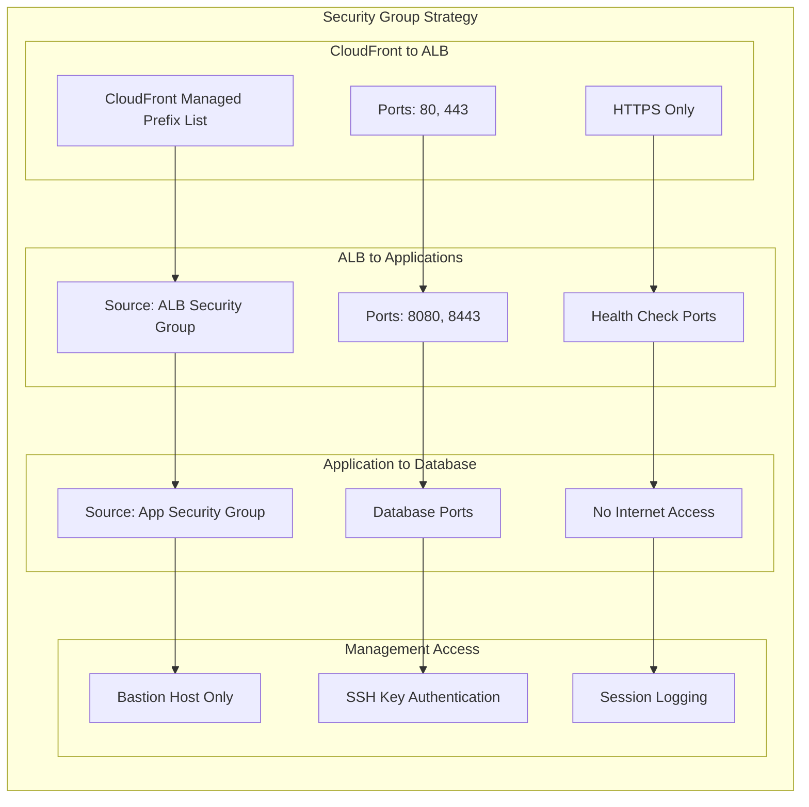

### Network ACL Configuration

| Rule | Type | Protocol | Port Range | Source/Destination | Action |
|------|------|----------|------------|-------------------|---------|
| 100 | Inbound | HTTPS | 443 | CloudFront Prefixes | ALLOW |
| 110 | Inbound | HTTP | 80 | CloudFront Prefixes | ALLOW |
| 120 | Inbound | SSH | 22 | Management CIDR | ALLOW |
| 200 | Outbound | HTTPS | 443 | 0.0.0.0/0 | ALLOW |
| 210 | Outbound | HTTP | 80 | 0.0.0.0/0 | ALLOW |
| 220 | Outbound | Database | 5432/3306 | Private Subnets | ALLOW |
| * | All | All | All | All | DENY |

## 🔒 Data Protection

### Encryption Strategy

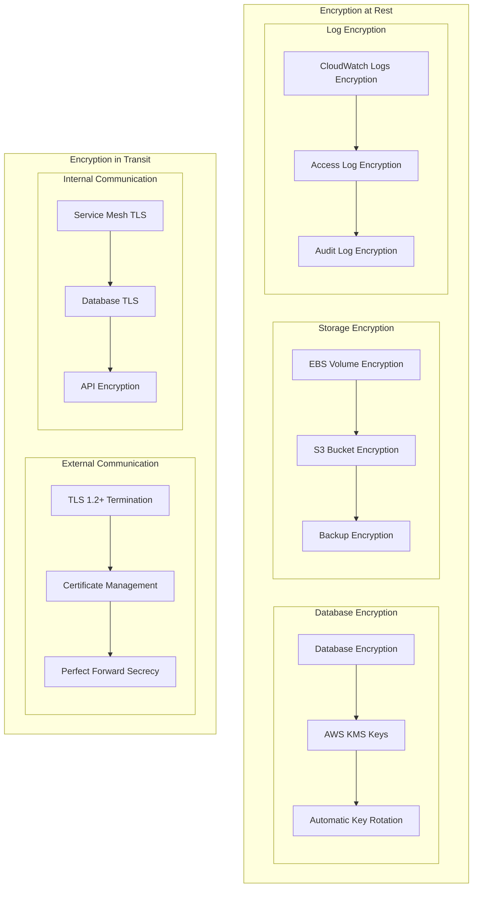

### Secrets Management

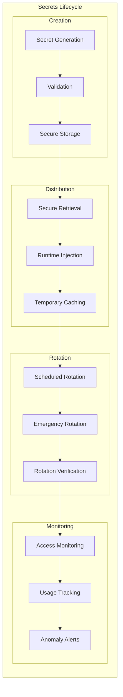

### Data Classification

| Classification | Description | Protection Level | Examples |
|----------------|-------------|-----------------|----------|
| **Public** | Publicly available information | Basic | Documentation, Marketing |
| **Internal** | Internal business information | Standard | Configurations, Logs |
| **Confidential** | Sensitive business information | Enhanced | API Keys, Metrics |
| **Restricted** | Highly sensitive information | Maximum | Customer Data, Credentials |

## 📊 Monitoring & Incident Response

### Security Monitoring Architecture

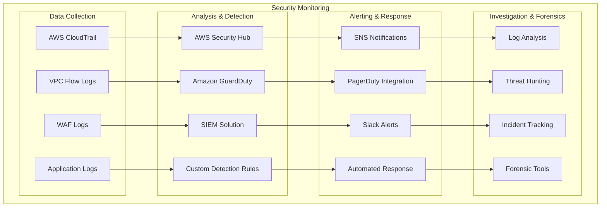

### Incident Response Workflow

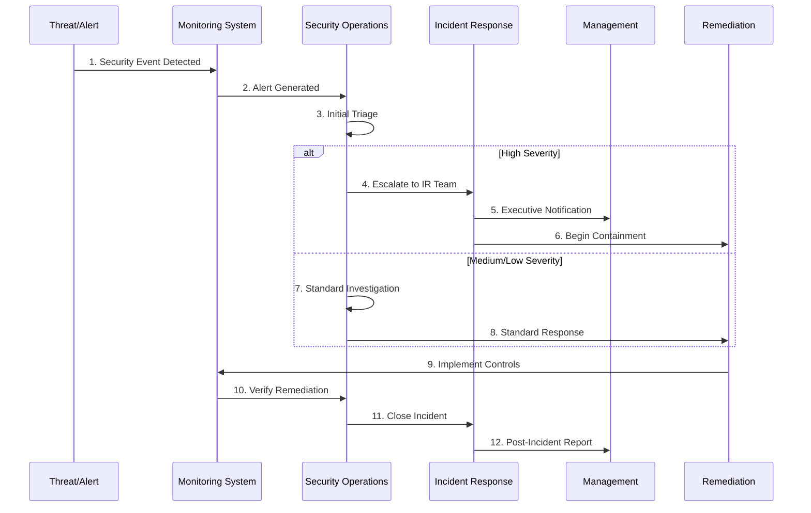

### Security Metrics and KPIs

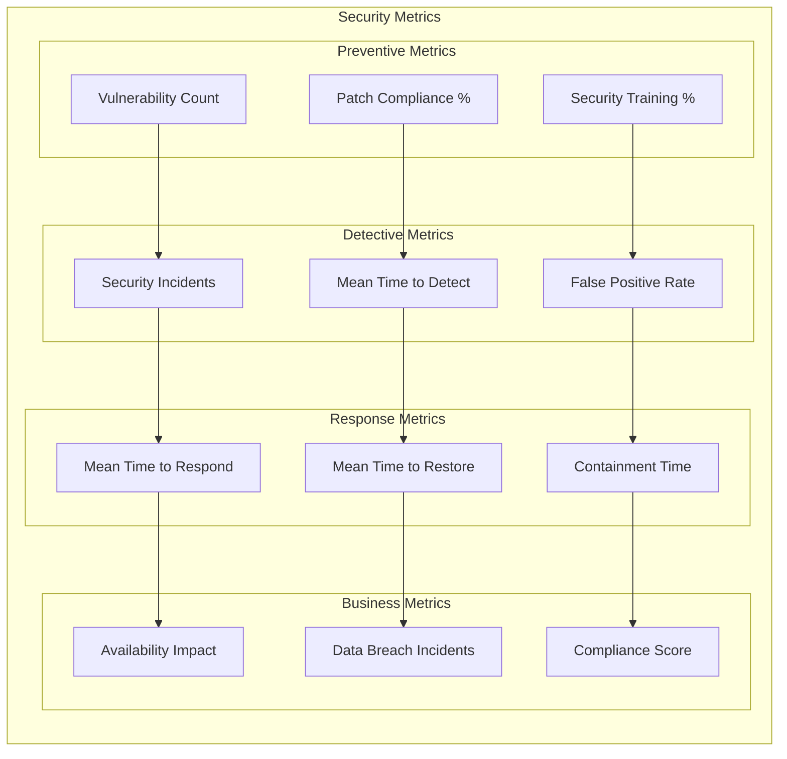

## 📋 Compliance & Governance

### Compliance Framework

```mermaid
graph TB
    subgraph "Compliance Standards"
        subgraph "Data Protection"
            GDPR[GDPR Compliance]
            CCPA[CCPA Compliance]
            DataResidency[Data Residency]
        end

        subgraph "Security Standards"
            SOC2[SOC 2 Type II]
            ISO27001[ISO 27001]
            NIST[NIST Framework]
        end

        subgraph "Industry Specific"
            HIPAA[HIPAA (Healthcare)]
            PCI[PCI DSS (Payment)]
            FedRAMP[FedRAMP (Government)]
        end

        subgraph "Regional Standards"
            APRA[APRA (Australia)]
            MAS[MAS (Singapore)]
            BSI[BSI (Germany)]
        end
    end

    GDPR --> SOC2
    CCPA --> ISO27001
    DataResidency --> NIST

    SOC2 --> HIPAA
    ISO27001 --> PCI
    NIST --> FedRAMP

    HIPAA --> APRA
    PCI --> MAS
    FedRAMP --> BSI
```

### Governance Controls

| Control Domain | Control | Implementation | Validation |
|----------------|---------|----------------|------------|
| **Access Control** | Least Privilege | IAM Policies | Regular Access Reviews |
| **Data Protection** | Encryption | KMS + TLS | Encryption Validation |
| **Network Security** | Segmentation | Security Groups | Network Testing |
| **Monitoring** | Security Logging | CloudTrail + WAF | Log Analysis |
| **Incident Response** | Response Plan | Documented Procedures | Tabletop Exercises |
| **Business Continuity** | Backup & Recovery | Automated Backups | Recovery Testing |

### Audit and Compliance Monitoring

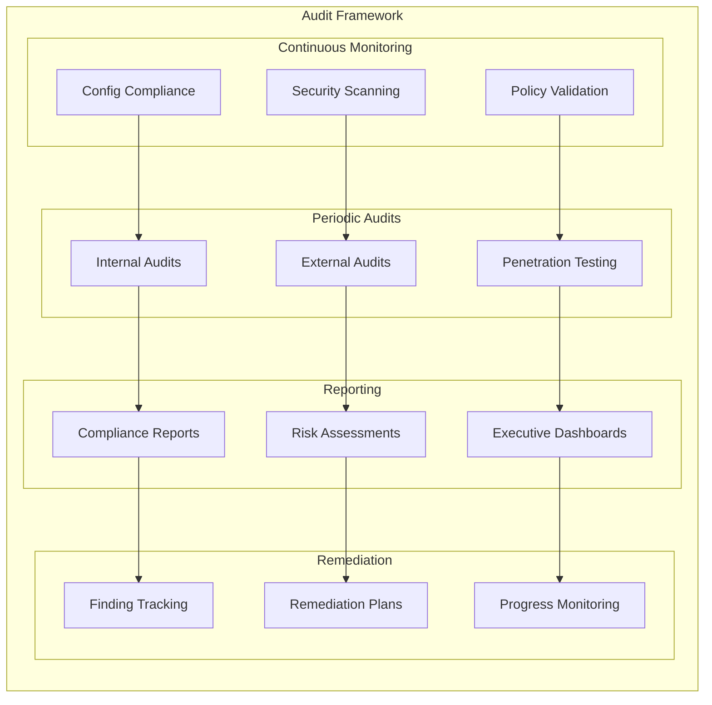

## ✅ Security Checklist

### Pre-Deployment Security Checklist

#### SSL/TLS Configuration
- [ ] TLS 1.2+ enforced (no TLS 1.0/1.1)
- [ ] Strong cipher suites configured
- [ ] Certificate from trusted CA
- [ ] Certificate includes all required domains
- [ ] HSTS headers configured
- [ ] Certificate transparency monitoring

#### CloudFront Security
- [ ] WAF rules configured and tested
- [ ] Custom headers implemented
- [ ] Geo-blocking configured (if required)
- [ ] Rate limiting configured
- [ ] DDoS protection enabled
- [ ] Access logging enabled

#### Network Security
- [ ] Security groups configured with least privilege
- [ ] Network ACLs configured
- [ ] VPC flow logs enabled
- [ ] Private subnets for applications
- [ ] No direct internet access to databases
- [ ] Bastion host for management access

#### Application Security
- [ ] Input validation implemented
- [ ] Output encoding implemented
- [ ] Authentication mechanisms tested
- [ ] Authorization controls verified
- [ ] Session management secure
- [ ] Error handling doesn't leak information

#### Data Protection
- [ ] Encryption at rest enabled
- [ ] Encryption in transit enforced
- [ ] Key management strategy implemented
- [ ] Data classification completed
- [ ] Backup encryption verified
- [ ] Data retention policies defined

### Runtime Security Checklist

#### Monitoring and Alerting
- [ ] Security monitoring configured
- [ ] Anomaly detection enabled
- [ ] Incident response procedures documented
- [ ] Security metrics being collected
- [ ] Alerting thresholds configured
- [ ] 24/7 monitoring capability

#### Access Management
- [ ] Regular access reviews scheduled
- [ ] Privileged access monitored
- [ ] Service accounts rotated
- [ ] API key rotation implemented
- [ ] Multi-factor authentication enforced
- [ ] Session timeout configured

#### Vulnerability Management
- [ ] Regular vulnerability scanning
- [ ] Patch management process
- [ ] Dependency scanning enabled
- [ ] Security testing in CI/CD
- [ ] Penetration testing scheduled
- [ ] Bug bounty program considered

### Post-Incident Security Checklist

#### Immediate Response
- [ ] Incident contained and isolated
- [ ] Forensic evidence preserved
- [ ] Stakeholders notified
- [ ] Communications plan activated
- [ ] Regulatory notifications sent (if required)
- [ ] Legal counsel engaged (if required)

#### Recovery and Lessons Learned
- [ ] Root cause analysis completed
- [ ] Security controls updated
- [ ] Monitoring rules enhanced
- [ ] Staff training updated
- [ ] Documentation updated
- [ ] Post-incident review conducted

## 🚨 Security Alerts and Notifications

### Alert Severity Levels

| Severity | Response Time | Escalation | Examples |
|----------|---------------|------------|----------|
| **Critical** | < 15 minutes | Immediate | Data breach, Active attack |
| **High** | < 1 hour | Within 2 hours | Failed authentication attempts |
| **Medium** | < 4 hours | Next business day | Policy violations |
| **Low** | < 24 hours | Weekly review | Information gathering |

### Emergency Contacts

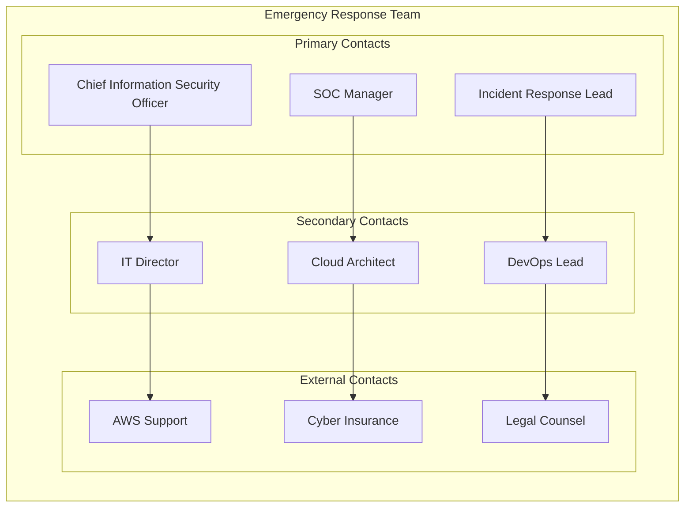
