# CloudFront SSL Setup - Troubleshooting Guide

This comprehensive troubleshooting guide helps diagnose and resolve common issues with the CloudFront SSL Setup solution.

## 📋 Table of Contents

- [Quick Diagnosis](#quick-diagnosis)
- [SSL Certificate Issues](#ssl-certificate-issues)
- [CloudFront Distribution Issues](#cloudfront-distribution-issues)
- [DNS and Routing Issues](#dns-and-routing-issues)
- [Security Group and Network Issues](#security-group-and-network-issues)
- [Performance Issues](#performance-issues)
- [Monitoring and Alerting Issues](#monitoring-and-alerting-issues)
- [Script and Configuration Issues](#script-and-configuration-issues)
- [AWS Service Issues](#aws-service-issues)
- [Xignals Platform Specific Issues](#xignals-platform-specific-issues)

## 🔍 Quick Diagnosis

### Diagnostic Flow Chart

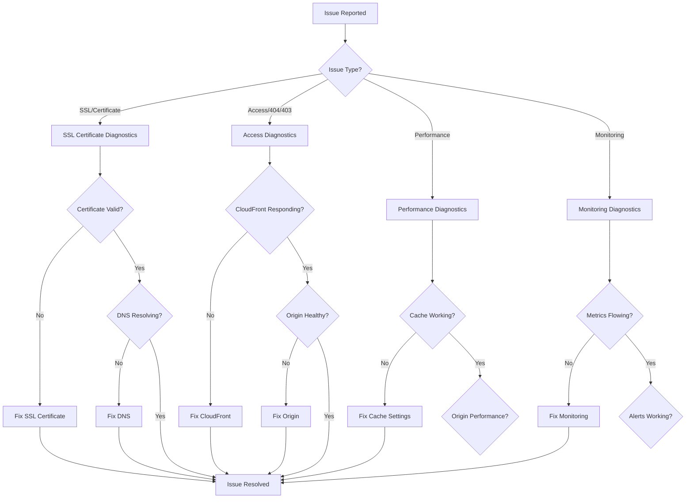

### Quick Health Check Script

```bash
#!/bin/bash
# Quick health check for CloudFront SSL setup

DOMAIN="${1:-xignals.xapiens.id}"
echo "🔍 Quick Health Check for: $DOMAIN"

# 1. DNS Resolution
echo "1. Checking DNS resolution..."
if dig +short "$DOMAIN" | grep -q "cloudfront.net"; then
    echo "✅ DNS resolves to CloudFront"
else
    echo "❌ DNS not resolving to CloudFront"
fi

# 2. SSL Certificate
echo "2. Checking SSL certificate..."
if echo | openssl s_client -connect "$DOMAIN:443" -servername "$DOMAIN" 2>/dev/null | grep -q "Verify return code: 0"; then
    echo "✅ SSL certificate valid"
else
    echo "❌ SSL certificate issues"
fi

# 3. HTTP to HTTPS Redirect
echo "3. Checking HTTPS redirect..."
HTTP_STATUS=$(curl -s -o /dev/null -w "%{http_code}" "http://$DOMAIN")
if [[ "$HTTP_STATUS" =~ ^30[12]$ ]]; then
    echo "✅ HTTP redirects to HTTPS"
else
    echo "❌ HTTP redirect not working (status: $HTTP_STATUS)"
fi

# 4. CloudFront Headers
echo "4. Checking CloudFront headers..."
if curl -s -I "https://$DOMAIN" | grep -qi "x-cache"; then
    echo "✅ CloudFront headers present"
else
    echo "❌ CloudFront headers missing"
fi

# 5. Origin Response
echo "5. Checking origin response..."
RESPONSE_CODE=$(curl -s -o /dev/null -w "%{http_code}" "https://$DOMAIN")
if [[ "$RESPONSE_CODE" =~ ^2[0-9][0-9]$ ]]; then
    echo "✅ Origin responding successfully (${RESPONSE_CODE})"
else
    echo "❌ Origin response issues (${RESPONSE_CODE})"
fi

echo "🏁 Health check complete"
```

## 🔐 SSL Certificate Issues

### Certificate Validation Failures

**Symptoms:**
- Certificate request stuck in "Pending Validation"
- DNS validation not completing
- Certificate shows as "Failed"

**Diagnosis Flow:**

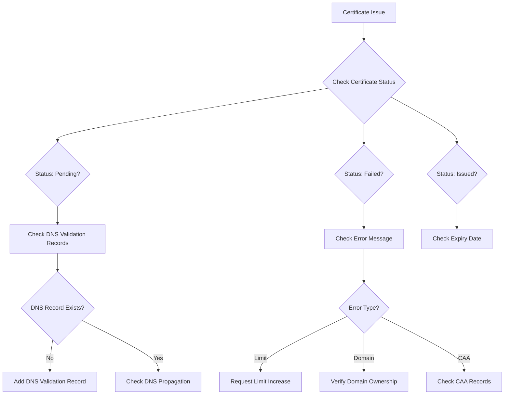

**Common Solutions:**

1. **DNS Validation Record Missing:**
```bash
# Check if validation record exists
dig _abc123def456.xignals.xapiens.id CNAME

# If missing, add the record from ACM console or CLI
aws route53 change-resource-record-sets \
    --hosted-zone-id Z1234567890ABC \
    --change-batch '{
        "Changes": [{
            "Action": "CREATE",
            "ResourceRecordSet": {
                "Name": "_abc123def456.xignals.xapiens.id",
                "Type": "CNAME",
                "TTL": 300,
                "ResourceRecords": [{"Value": "_xyz789abc123.acm-validations.aws."}]
            }
        }]
    }'
```

2. **DNS Propagation Issues:**
```bash
# Check DNS propagation globally
dig @8.8.8.8 _abc123def456.xignals.xapiens.id CNAME
dig @1.1.1.1 _abc123def456.xignals.xapiens.id CNAME

# Wait for propagation (can take up to 48 hours, usually 5-10 minutes)
```

3. **CAA Record Issues:**
```bash
# Check CAA records
dig xapiens.id CAA

# If restrictive CAA records exist, add Amazon CA
dig CAA +short xapiens.id
# Should include: 0 issue "amazon.com" or 0 issue "amazontrust.com"
```

### Certificate Renewal Issues

**Symptoms:**
- Certificate expiring soon without renewal
- Automatic renewal failed
- New certificate not applied to CloudFront

**Solutions:**

1. **Check Auto-Renewal Status:**
```bash
aws acm describe-certificate \
    --certificate-arn arn:aws:acm:us-east-1:123456789012:certificate/12345678 \
    --query 'Certificate.RenewalEligibility'
```

2. **Manual Renewal Trigger:**
```bash
aws acm renew-certificate \
    --certificate-arn arn:aws:acm:us-east-1:123456789012:certificate/12345678
```

3. **Update CloudFront with New Certificate:**
```bash
# Get current distribution config
aws cloudfront get-distribution-config --id E1234567890ABC > current-config.json

# Update certificate ARN in the config file
# Then update the distribution
aws cloudfront update-distribution \
    --id E1234567890ABC \
    --distribution-config file://updated-config.json \
    --if-match $(jq -r '.ETag' current-config.json)
```

## ☁️ CloudFront Distribution Issues

### Distribution Creation Failures

**Common Error Scenarios:**

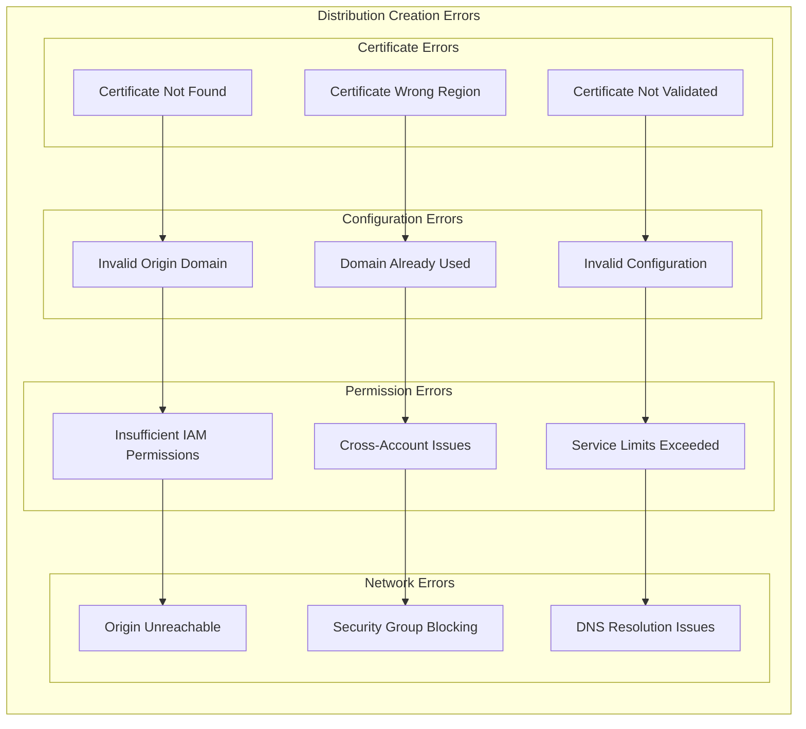

**Diagnostic Commands:**

1. **Check Certificate Status:**
```bash
# List certificates in us-east-1 (required for CloudFront)
aws acm list-certificates --region us-east-1

# Check specific certificate
aws acm describe-certificate \
    --certificate-arn arn:aws:acm:us-east-1:123456789012:certificate/12345678 \
    --region us-east-1
```

2. **Verify Origin Accessibility:**
```bash
# Test origin directly
curl -I https://your-alb-dns-name.elb.amazonaws.com \
    -H "Host: xignals.xapiens.id"

# Check if origin responds to CloudFront User-Agent
curl -I https://your-alb-dns-name.elb.amazonaws.com \
    -H "Host: xignals.xapiens.id" \
    -H "User-Agent: Amazon CloudFront"
```

3. **Check Service Limits:**
```bash
# Check CloudFront distribution limits
aws service-quotas get-service-quota \
    --service-code cloudfront \
    --quota-code L-1B755E80

# List current distributions
aws cloudfront list-distributions \
    --query 'DistributionList.Items[].{Id:Id,Domain:DomainName,Status:Status}'
```

### 403 Forbidden Errors

**Error Analysis Flow:**

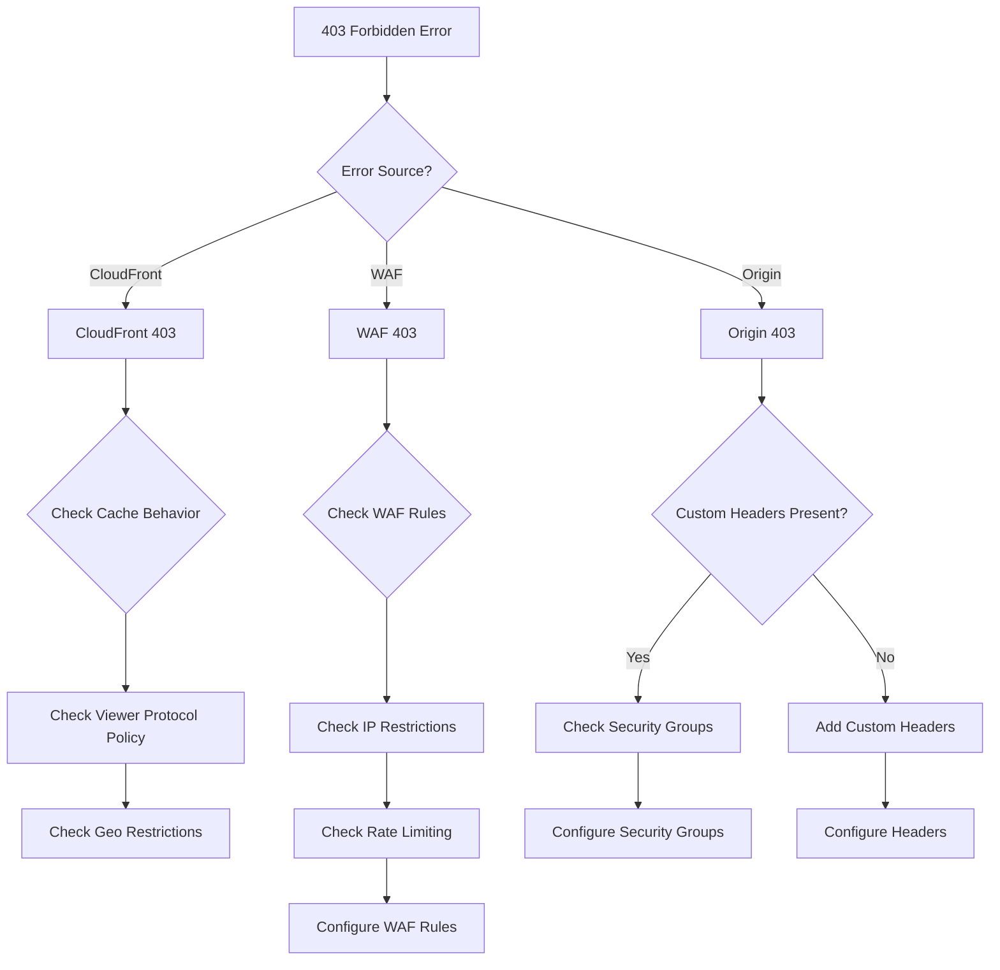

**Solutions:**

1. **CloudFront 403 - Geo Restrictions:**
```bash
# Check geo restrictions
aws cloudfront get-distribution-config --id E1234567890ABC \
    | jq '.DistributionConfig.Restrictions'

# Remove geo restrictions if needed
# Update distribution config with empty restrictions
```

2. **Origin 403 - Missing Custom Headers:**
```bash
# Test with custom header
curl -I https://your-alb-dns-name.elb.amazonaws.com \
    -H "Host: xignals.xapiens.id" \
    -H "X-CloudFront-Secret: your-secret-value"

# If this works, the issue is missing custom header validation
```

3. **WAF 403 - Rule Blocking:**
```bash
# Check WAF logs
aws logs filter-log-events \
    --log-group-name aws-waf-logs-cloudfront \
    --filter-pattern "{ $.action = \"BLOCK\" }" \
    --start-time $(date -d '1 hour ago' +%s)000

# Check specific WAF rule
aws wafv2 get-web-acl \
    --scope CLOUDFRONT \
    --id your-web-acl-id \
    --name your-web-acl-name
```

### Cache Behavior Issues

**Cache Miss Problems:**

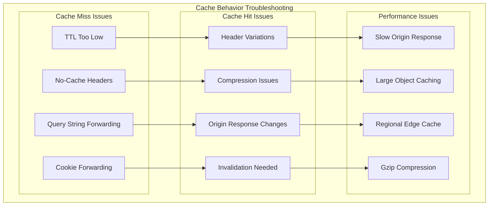

**Diagnostic Commands:**

1. **Check Cache Headers:**
```bash
# Check cache status
curl -I https://xignals.xapiens.id/api/v1/health
# Look for: X-Cache: Hit from cloudfront or Miss from cloudfront

# Check TTL settings
curl -I https://xignals.xapiens.id/static/app.js
# Look for: Cache-Control, Expires headers
```

2. **Analyze Cache Statistics:**
```bash
# Get cache hit ratio
aws cloudwatch get-metric-statistics \
    --namespace AWS/CloudFront \
    --metric-name CacheHitRate \
    --dimensions Name=DistributionId,Value=E1234567890ABC \
    --start-time 2025-01-30T00:00:00Z \
    --end-time 2025-01-30T23:59:59Z \
    --period 3600 \
    --statistics Average
```

3. **Create Invalidation:**
```bash
# Invalidate specific paths
aws cloudfront create-invalidation \
    --distribution-id E1234567890ABC \
    --invalidation-batch '{
        "Paths": {
            "Quantity": 2,
            "Items": ["/api/*", "/dashboard/*"]
        },
        "CallerReference": "invalidation-'$(date +%s)'"
    }'
```

## 🌐 DNS and Routing Issues

### DNS Resolution Problems

**DNS Troubleshooting Flow:**

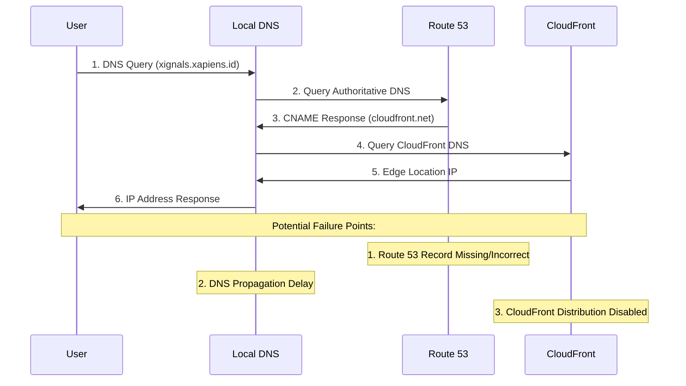

**Diagnostic Commands:**

1. **Check DNS Propagation:**
```bash
# Check from multiple DNS servers
dig @8.8.8.8 xignals.xapiens.id
dig @1.1.1.1 xignals.xapiens.id
dig @208.67.222.222 xignals.xapiens.id

# Check globally
for server in 8.8.8.8 1.1.1.1 208.67.222.222 9.9.9.9; do
    echo "Checking $server:"
    dig @$server xignals.xapiens.id +short
done
```

2. **Verify Route 53 Configuration:**
```bash
# List hosted zones
aws route53 list-hosted-zones \
    --query 'HostedZones[?Name==`xapiens.id.`]'

# Check specific record
aws route53 list-resource-record-sets \
    --hosted-zone-id Z1234567890ABC \
    --query 'ResourceRecordSets[?Name==`xignals.xapiens.id.`]'
```

3. **Test DNS Resolution Steps:**
```bash
# Test each step of DNS resolution
nslookup xignals.xapiens.id
nslookup $(dig +short xignals.xapiens.id)

# Check DNS trace
dig +trace xignals.xapiens.id
```

### CNAME Conflicts

**Symptoms:**
- DNS resolution returns unexpected results
- Multiple CNAME records
- Circular CNAME references

**Solutions:**

1. **Check for Conflicts:**
```bash
# Check for multiple CNAME records
dig xignals.xapiens.id CNAME +short

# Check for conflicting A records
dig xignals.xapiens.id A +short
```

2. **Fix CNAME Conflicts:**
```bash
# Remove conflicting records
aws route53 change-resource-record-sets \
    --hosted-zone-id Z1234567890ABC \
    --change-batch '{
        "Changes": [{
            "Action": "DELETE",
            "ResourceRecordSet": {
                "Name": "xignals.xapiens.id",
                "Type": "A",
                "TTL": 300,
                "ResourceRecords": [{"Value": "1.2.3.4"}]
            }
        }]
    }'
```

## 🔒 Security Group and Network Issues

### Security Group Misconfigurations

**Security Group Analysis:**

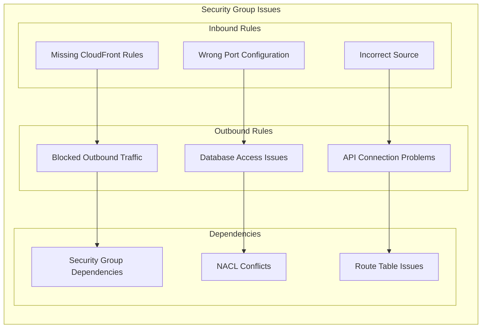

**Diagnostic Commands:**

1. **Check Security Group Rules:**
```bash
# Get security group details
aws ec2 describe-security-groups \
    --group-ids sg-0123456789abcdef0 \
    --query 'SecurityGroups[0].IpPermissions'

# Check for CloudFront prefix list
aws ec2 describe-security-groups \
    --group-ids sg-0123456789abcdef0 \
    --query 'SecurityGroups[0].IpPermissions[?PrefixListIds[?PrefixListId==`com.amazonaws.global.cloudfront.origin-facing`]]'
```

2. **Test Network Connectivity:**
```bash
# Test from CloudFront to ALB (simulate)
curl -I https://your-alb-dns-name.elb.amazonaws.com \
    -H "Host: xignals.xapiens.id" \
    -H "X-CloudFront-Secret: your-secret"

# Test specific ports
nc -zv your-alb-dns-name.elb.amazonaws.com 443
nc -zv your-alb-dns-name.elb.amazonaws.com 80
```

3. **Add Missing CloudFront Rules:**
```bash
# Add CloudFront managed prefix list rules
aws ec2 authorize-security-group-ingress \
    --group-id sg-0123456789abcdef0 \
    --protocol tcp \
    --port 443 \
    --source-prefix-list-id com.amazonaws.global.cloudfront.origin-facing

aws ec2 authorize-security-group-ingress \
    --group-id sg-0123456789abcdef0 \
    --protocol tcp \
    --port 80 \
    --source-prefix-list-id com.amazonaws.global.cloudfront.origin-facing
```

### VPC Flow Logs Analysis

**Flow Logs Troubleshooting:**

```bash
# Enable VPC Flow Logs (if not enabled)
aws ec2 create-flow-logs \
    --resource-type VPC \
    --resource-ids vpc-12345678 \
    --traffic-type ALL \
    --log-destination-type cloud-watch-logs \
    --log-group-name VPCFlowLogs

# Query flow logs for rejected traffic
aws logs filter-log-events \
    --log-group-name VPCFlowLogs \
    --filter-pattern "REJECT" \
    --start-time $(date -d '1 hour ago' +%s)000 \
    --limit 50
```

## ⚡ Performance Issues

### Slow Response Times

**Performance Diagnosis:**

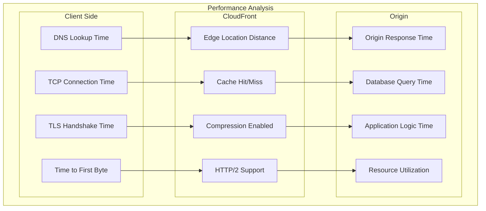

**Performance Testing Commands:**

1. **Comprehensive Performance Test:**
```bash
# Create curl timing template
cat > curl-format.txt << 'EOF'
     time_namelookup:  %{time_namelookup}\n
        time_connect:  %{time_connect}\n
     time_appconnect:  %{time_appconnect}\n
    time_pretransfer:  %{time_pretransfer}\n
       time_redirect:  %{time_redirect}\n
  time_starttransfer:  %{time_starttransfer}\n
                     ----------\n
          time_total:  %{time_total}\n
EOF

# Test performance
curl -w "@curl-format.txt" -o /dev/null -s https://xignals.xapiens.id
```

2. **Test Different Edge Locations:**
```bash
# Test from different regions (using VPN or different servers)
for region in us-east-1 eu-west-1 ap-southeast-1; do
    echo "Testing from $region:"
    # Run performance test from each region
done
```

3. **Monitor CloudFront Performance:**
```bash
# Get CloudFront metrics
aws cloudwatch get-metric-statistics \
    --namespace AWS/CloudFront \
    --metric-name OriginLatency \
    --dimensions Name=DistributionId,Value=E1234567890ABC \
    --start-time 2025-01-30T00:00:00Z \
    --end-time 2025-01-30T23:59:59Z \
    --period 3600 \
    --statistics Average,Maximum
```

### Cache Optimization

**Cache Performance Issues:**

1. **Low Cache Hit Ratio:**
```bash
# Check cache hit ratio
aws cloudwatch get-metric-statistics \
    --namespace AWS/CloudFront \
    --metric-name CacheHitRate \
    --dimensions Name=DistributionId,Value=E1234567890ABC \
    --start-time 2025-01-30T00:00:00Z \
    --end-time 2025-01-30T23:59:59Z \
    --period 3600 \
    --statistics Average

# Analyze cache headers
curl -I https://xignals.xapiens.id/api/v1/metrics
```

2. **Optimize Cache Behaviors:**
```bash
# Check current cache behaviors
aws cloudfront get-distribution-config --id E1234567890ABC \
    | jq '.DistributionConfig.CacheBehaviors'

# Update cache behaviors for better performance
# Edit distribution configuration to optimize TTL values
```

## 📊 Monitoring and Alerting Issues

### Missing Metrics

**Monitoring Troubleshooting:**

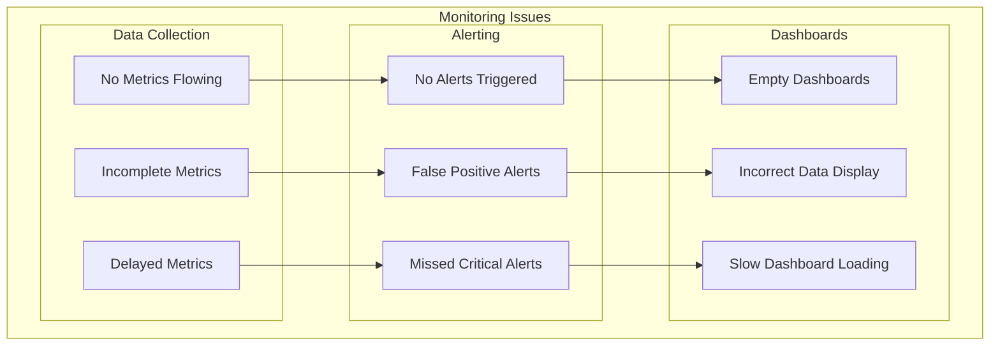

**Diagnostic Commands:**

1. **Check CloudWatch Metrics:**
```bash
# List available metrics
aws cloudwatch list-metrics \
    --namespace AWS/CloudFront \
    --dimensions Name=DistributionId,Value=E1234567890ABC

# Check if metrics are being published
aws cloudwatch get-metric-statistics \
    --namespace AWS/CloudFront \
    --metric-name Requests \
    --dimensions Name=DistributionId,Value=E1234567890ABC \
    --start-time $(date -d '1 hour ago' --iso-8601) \
    --end-time $(date --iso-8601) \
    --period 300 \
    --statistics Sum
```

2. **Verify Alarm Configuration:**
```bash
# List CloudWatch alarms
aws cloudwatch describe-alarms \
    --alarm-name-prefix "CloudFront-"

# Check alarm state
aws cloudwatch describe-alarms \
    --alarm-names "CloudFront-HighErrorRate-xignals-xapiens-id" \
    --query 'MetricAlarms[0].{State:StateValue,Reason:StateReason}'
```

3. **Test Alert Notifications:**
```bash
# Manually trigger alarm for testing
aws cloudwatch set-alarm-state \
    --alarm-name "CloudFront-HighErrorRate-xignals-xapiens-id" \
    --state-value ALARM \
    --state-reason "Testing alarm notification"

# Check SNS topic subscriptions
aws sns list-subscriptions-by-topic \
    --topic-arn arn:aws:sns:us-east-1:123456789012:cloudfront-alerts
```

## 🛠️ Script and Configuration Issues

### Script Execution Failures

**Common Script Issues:**

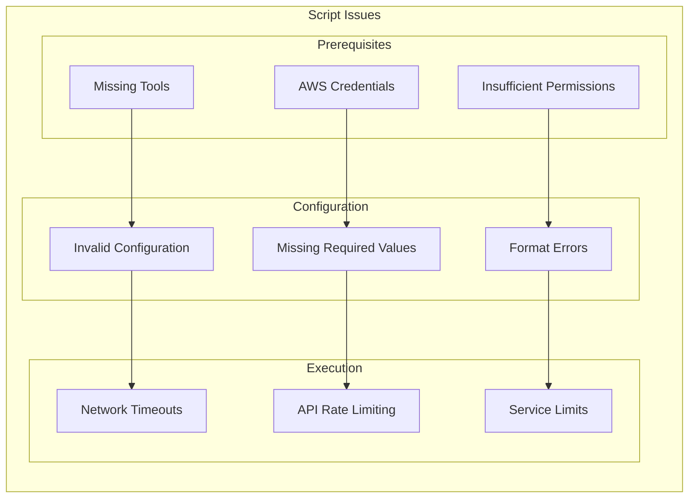

**Diagnostic Steps:**

1. **Verify Prerequisites:**
```bash
# Check required tools
./scripts/install-deps.sh --verify-only

# Verify AWS credentials
aws sts get-caller-identity

# Check AWS CLI version
aws --version
```

2. **Validate Configuration:**
```bash
# Validate JSON configuration files
find . -name "*.json" -exec jq empty {} \;

# Check configuration values
grep -n "REQUIRED" cloudfront-config.conf
```

3. **Debug Script Execution:**
```bash
# Run with debug mode
export DEBUG=true
bash -x ./cloudfront-ssl-setup.sh --config cloudfront-config.conf

# Check script logs
tail -f setup.log
```

### Configuration Validation Errors

**Common Configuration Problems:**

| Error Type | Symptoms | Solution |
|------------|----------|----------|
| **Missing Values** | "Required field empty" | Check configuration template |
| **Invalid Domain** | "Domain format invalid" | Verify domain name format |
| **Wrong Region** | "Certificate not found" | Ensure certificate in us-east-1 |
| **Invalid ARN** | "Resource not found" | Verify ARN format and existence |
| **Permission Denied** | "Access denied" | Check IAM permissions |

## ☁️ AWS Service Issues

### Service Outages and Limits

**AWS Service Health Check:**

```bash
# Check AWS service status
curl -s "https://status.aws.amazon.com/data.json" | jq '.'

# Check service limits
aws service-quotas list-service-quotas \
    --service-code cloudfront \
    --query 'Quotas[?QuotaName==`Distributions per AWS account`]'

# Request limit increase if needed
aws service-quotas request-service-quota-increase \
    --service-code cloudfront \
    --quota-code L-1B755E80 \
    --desired-value 100
```

### API Rate Limiting

**Rate Limiting Issues:**

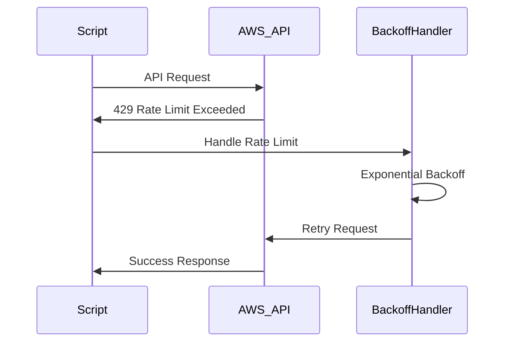

**Solutions:**

1. **Implement Exponential Backoff:**
```bash
# Example retry function
retry_with_backoff() {
    local max_attempts=5
    local delay=1
    local attempt=1

    while [ $attempt -le $max_attempts ]; do
        if "$@"; then
            return 0
        fi

        echo "Attempt $attempt failed. Retrying in ${delay}s..."
        sleep $delay
        delay=$((delay * 2))
        attempt=$((attempt + 1))
    done

    echo "Command failed after $max_attempts attempts"
    return 1
}

# Usage
retry_with_backoff aws cloudfront create-distribution --distribution-config file://config.json
```

## 🎯 Xignals Platform Specific Issues

### Observability Data Flow Issues

**Xignals-Specific Troubleshooting:**

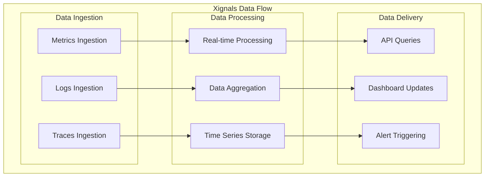

**Xignals Diagnostic Commands:**

1. **Check Observability Endpoints:**
```bash
# Test metrics endpoint
curl -H "Authorization: Bearer $API_TOKEN" \
     https://xignals.xapiens.id/api/v1/metrics/health

# Test logs endpoint
curl -H "Authorization: Bearer $API_TOKEN" \
     https://xignals.xapiens.id/api/v1/logs/health

# Test traces endpoint
curl -H "Authorization: Bearer $API_TOKEN" \
     https://xignals.xapiens.id/api/v1/traces/health
```

2. **Verify Cache Behavior for Real-time Data:**
```bash
# Check that real-time endpoints are not cached
curl -I https://xignals.xapiens.id/api/v1/metrics/realtime
# Should show: Cache-Control: no-cache or similar

# Check static assets are cached
curl -I https://xignals.xapiens.id/static/dashboard.js
# Should show: Cache-Control: max-age=3600 or similar
```

3. **Monitor Xignals Performance:**
```bash
# Check API response times
curl -w "@curl-format.txt" -o /dev/null -s \
     -H "Authorization: Bearer $API_TOKEN" \
     https://xignals.xapiens.id/api/v1/query

# Check WebSocket connections (if applicable)
wscat -c wss://xignals.xapiens.id/websocket/metrics
```

### Multi-Tenant Issues

**Multi-Tenant Troubleshooting:**

1. **Tenant Isolation Verification:**
```bash
# Test tenant A data access
curl -H "Authorization: Bearer $TENANT_A_TOKEN" \
     https://xignals.xapiens.id/api/v1/metrics?tenant=A

# Test tenant B cannot access tenant A data
curl -H "Authorization: Bearer $TENANT_B_TOKEN" \
     https://xignals.xapiens.id/api/v1/metrics?tenant=A
# Should return 403 Forbidden
```

2. **Cache Separation Verification:**
```bash
# Check cache keys include tenant information
curl -I -H "X-Tenant-ID: tenant-a" \
     https://xignals.xapiens.id/api/v1/dashboard

curl -I -H "X-Tenant-ID: tenant-b" \
     https://xignals.xapiens.id/api/v1/dashboard
# Should have different cache behaviors
```

## 🆘 Emergency Recovery Procedures

### Emergency Response Checklist

**Critical Issue Response:**

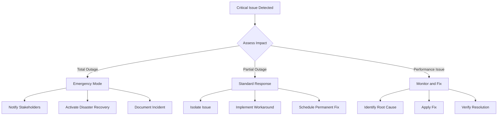

**Emergency Commands:**

1. **Immediate Health Check:**
```bash
# Quick system status
./scripts/quick-health-check.sh xignals.xapiens.id

# Check all critical endpoints
for endpoint in health metrics logs traces; do
    echo "Testing $endpoint..."
    curl -f "https://xignals.xapiens.id/api/v1/$endpoint" || echo "FAILED"
done
```

2. **Emergency Rollback:**
```bash
# Emergency CloudFront rollback
./scripts/disaster-recovery.sh emergency-rollback cloudfront E1234567890ABC

# Emergency DNS rollback
./scripts/disaster-recovery.sh emergency-rollback dns xapiens.id
```

3. **Emergency Communication:**
```bash
# Send emergency notification
aws sns publish \
    --topic-arn arn:aws:sns:us-east-1:123456789012:emergency-alerts \
    --message "CRITICAL: Xignals platform experiencing issues. Investigation in progress."

# Update status page
curl -X POST "https://api.statuspage.io/v1/pages/your-page-id/incidents" \
     -H "Authorization: OAuth your-token" \
     -d '{"incident": {"name": "Service Degradation", "status": "investigating"}}'
```
